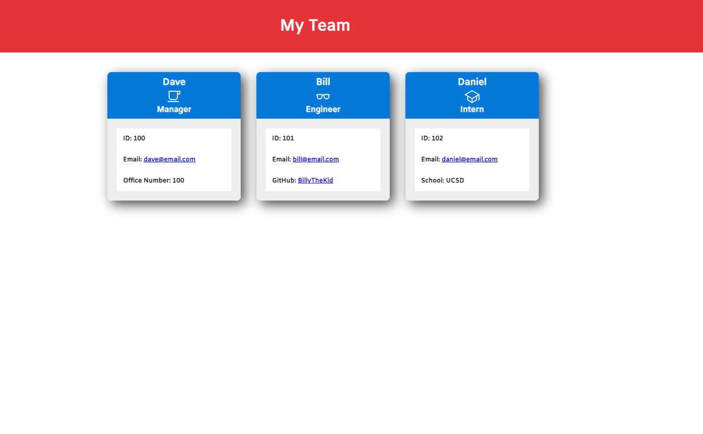

# Team Profile Generator


## Description

This project is a node.js based command-line application that takes in information about employees on a software engineering team, then generates an HTML webpage that displays summaries for each person. The application utilizes the inquirer package and also has tests included in order to ensure that the functionality works as intended.

The video walkthrough showing the functionality of the application may be accessed [here](https://drive.google.com/file/d/17aXB4nL2yTaD_kI9aEtElJrpGvGh64lW/view).

A screenshot of the generated HTML page from the video is shown below:



## Table of Contents

- [Credits](#credits)
- [Usage](#usage)
- [Installation](#installation)
- [Testing](#testing)
- [License](#license)
- [Questions](#questions)


## Credits

This project is the original work of Dallas Sybrowsky. More of my work is available on GitHub at [DallasSybrowsky](https://github.com/DallasSybrowsky).

## Usage

This application takes in input about members of a software engineering team and generates an HTML webpage. In order to utilize the application please follow the prompt questions.

## Installation

In order to install the package, please use the following command: 

```
npm i
```

## Testing

In order to run tests, please utilize the following command: 

```
npm test
```

## License

This project is covered under the MIT license. For detailed licensing information please refer to the MIT license information.

## Questions

If you have any questions, you may contact me directly at: dallas.sybrowsky@gmail.com.